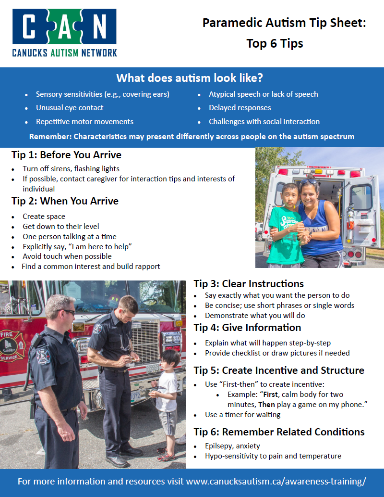

# Autism Tip Sheet   Paramedic Interaction

## Purpose

To provide clear, concise communication and interaction strategies for patients on the autism spectrum.

!!! info "Source Material"

    All information provided by the [Canucks Autism Network](https://www.canucksautism.ca/awareness-training/){:target="_blank" .external-link}

## Scope

Applicable to all BCEHS staff during any phase of patient contact or scene management. **Remember: Characteristics may present differently across people on the autism spectrum**

## Clinical Presentation

<u>What does autism look like?</u>

- Sensory sensitivities (e.g., covering ears)

- Unusual eye contact

- Repetitive motor movements

- Atypical speech or lack of speech

- Delayed responses

- Challenges with social interaction

## Tip 1: Before You Arrive

* Environment: Turn off sirens and flashing lights whenever possible. 

* Intelligence Gathering: If possible, contact the caregiver for specific interaction tips and the individual's personal interests

## Tip 2: When You Arrive

- Create space

- Get down to their level

- One person talking at a time

- Explicitly say, “I am here to help”

- Avoid touch when possible

- Find a common interest and build rapport

## Tip 3: Clear Instructions

- Say exactly what you want the person to do

- Be concise; use short phrases or single words

- Demonstrate what you will do

## Tip 4: Give Information

- Explain what will happen step-by-step

- Provide checklist or draw pictures if needed

## Tip 5: Create Incentive and Structure

- Use “First-then” to create incentive:

- Example: “First, calm body for two minutes, Then play a game on my phone.”

- Use a timer for waiting

## Tip 6: Remember Related Conditions

- Epilsepy, anxiety

- Hypo-sensitivity to pain and temperature

## Reference

[Canucks Autism Network](https://www.canucksautism.ca/awareness-training/){:target="_blank" .external-link}

## Review Schedule

| Adopted | Next Review Scheduled | Owner | Reviewer| 
| :--- | :--- | :--- | :--- | 
| Jan 2024 | Mar 2027 | CAN | CAN |