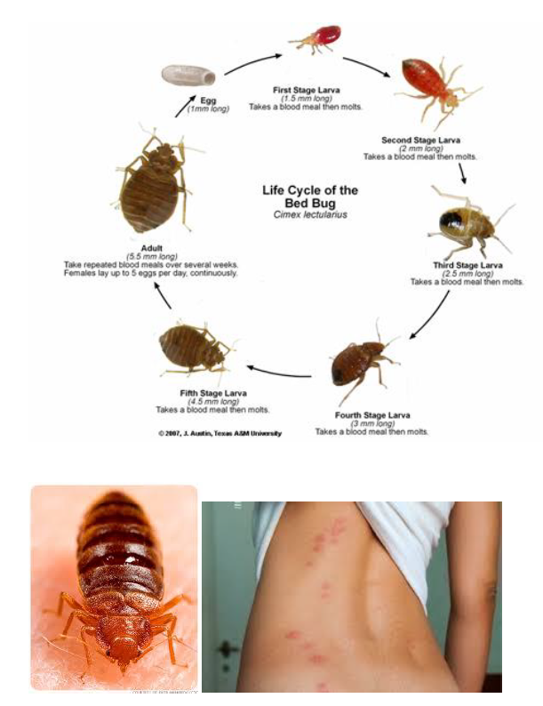

# Bed Bug Standard Operating Guidelines

## Purpose

To limit the exposures to both paramedics and patients to bed bugs. To ensure all equipment and clothing is clean and infestation free after a high-risk bed bug call.

## Scope

To all responding paramedic, supervisors and agencies that may be exposed to, or contaminated with bed bugs.

## Definitions

- SDS: Safety Data Sheet
- SDS Products: Specifically mention ACCEL / Accelerated Hydrogen Peroxide as the primary disinfectant.

## Policy

BC Emergency Health Services (BCEHS) is committed to protecting the health and safety of both patients and staff by minimizing the risk of bed bug (Cimex lectularius) transmission and infestation. **All responding paramedics and supervisors must perform a continuous on-scene risk assessment to identify potential bed bug presence.**When an infestation is suspected or confirmed, staff are mandated to utilize specific Personal Protective Equipment (PPE) and follow standardized containment and decontamination procedures for vehicles, equipment, and uniforms. Contaminated uniforms must not be laundered at home; they must be processed using high-heat cycles as outlined in the Exposure Control Plan to ensure complete eradication of insects and larvae.

## Quick Action

⚠️ **Critical Steps for Suspected Infestation:**

1. Don gown, gloves, and boot covers before entry.

2. Leave the stretcher and jump kits outside the residence.

3. Wrap the patient in a paper sheet and double-bag belongings.

4. Notify the receiving hospital and Dispatch immediately.

## Procedure

All staff using these materials must read the SDS before using these materials.
On all calls, an on-scene risk assessment should be performed to include the presence of bed bugs. If evidence of bed bugs is found the following procedures should be used.

### **Materials Needed**

Equipment is specific to bed bug risk; additional equipment will be necessary dependent on the call.

• Gloves

• Gown

• Boot protection/cover

• White plastic bag and/or white disposable stretcher sheet

• All equipment necessary to thoroughly clean the vehicle and equipment at completion of the call, including:

  - Disinfectant

  - Personal Protective Equipment (PPE)

### **Quick Facts**

• Bedbug (Cimex Lectularius)

• Wingless, Red / Brown, Blood Sucking Insect

• Lifespan 4 months to over a year

• Can grow to 7mm in length (…...)

• Hide during day in cracks, crevices, furniture

• Emerge at night

• Preferred host’s – Humans

• Infestations found in shelters, but also in some hotels in Vancouver in particular

• Bed bug bites different from scabies, or body lice

• While bedbugs are present in many environments paramedics may enter, it is unlikely you will be bitten. In one study at a shelter that was infested with bedbugs only 4% of residents who slept at the shelter had bites. The risk is very low for short term entry into areas with bedbugs and essentially nonexistent during the day. That all being said we have had staff bitten by the bugs on calls.
Bedbugs are well established in Metro Vancouver Area.

• The West End and Downtown Eastside have multiple reported infestations. You will encounter Bedbugs on calls but they will pose very little risk to you and there are some simple things to do to prevent them from getting into equipment.

• Bedbugs spend the daylight hours hidden away and are not an issue; they are night feeders and seek out humans in upholstered couches and in their beds. It would be very unlikely that you will be bitten
unless you spend significant time on an infected couch or in an infested bed. They do not fly or jump so putting equipment on a shelf or table is a good protective measure.

• Equipment should be cleaned as per normal using provided ACCEL disinfectants and cleaning supplies. If bedbugs are found in/on equipment wipe them off and clean as per normal practice. It is the larvae found on linens, bedding, curtains, shag carpets that you really want to prevent contacting. Personal Protective Ensemble (PPE) using boot covers, gowns, gloves should be utilized.

Uniforms should be laundered properly with hot water and detergent or dry cleaned.
(**Please not at home**)
If you do find a bite, wash the area with warm water and soap. Do not scratch.
An ice pack can provide relief from itching or pain if necessary. An Antihistamine if required for itching.

## Special Considerations

Pre-warning on a response to a known bed bug premise, crews should;
• Donn paper bootie covers, tuck in pant cuffs. Always wear appropriate PPE.
• Leave stretcher outside of residence or entranceway
• Leave jump kit outside or place on a higher-level counter, table etc. Never place kits on bedding, couches, or cloth surfaces.
• Turn on all lights, open curtains.
• Stay clear of clothing, bedding, and attempt to move patient removing current clothing and bedding replacing with laundered clothing, hospital gowns or Tyvek.
• Always maintain patient modesty.

## During the Call

1. On scene risk assessment performed, identifying presence or high suspicion of bed bug infestation (or previous history of bed bugs on the CAD).
2. Don gloves, gown and boot protection (additional PPE may be required according to the patient’s condition i.e. symptoms of influenza like illness).
3. Limit non-essential contact with the patient and the patient’s environment (including bedding, linens, clothing and curtains).
4. Bring the minimum equipment required for the call.
5. Place all equipment and kits on top of a white plastic bag and/or disposal stretcher sheet.
6. Open curtains if daylight, and turn all lights on to keep bed bugs inactive.
7. Minimize time spent in the residence; move the patient to the ambulance as soon as is safe to do so.
8. Avoid sitting or kneeling on upholstered furniture or carpets. If sitting or kneeling is necessary cover surface with a white plastic bag or foil blanket.
9. Where possible, have the patient remove all outer clothing and don a gown or Tyvek suit.
10. Wrap the patient in a paper sheet to contain any bed bugs that are present.
11. If the patients clothing or belongings must be transported with them, double bag them in clear plastic garment bags.
12. Transport the patient only; do not transport friends, family or bystanders from the scene.
13. Notify the receiving hospital of the possibility of bed bugs.

**If bedbugs are suspected from an individual:**

• Wrap patient in paper sheets and attempt to change clothing.

• All clothing bagged, tagged (name etc.) and sealed with a knot.

**If bedbugs are suspected in vehicle:**

• Donn paper bootie covers, tuck in pant cuffs. Always wear appropriate PPE

• Leave stretcher outside of vehicle for separate cleansing Remove all linen from vehicle, bag & seal for laundry

• Open all doors and allow as much light and UV lighting in to vehicle

• Clean (patient & crew compartments) as per usual looking at corners, dark areas and air out

## Following Completion of Call

1. Contact your Dispatch Center to request to be taken out of service to allow time for cleaning and disinfection following a bed bug exposure.
2. The Technical Advisor may be consulted as required if further cleaning/disinfection guidance is required.
3. Don gloves, gown and boot protection.
4. Remove all linen used on the call and place directly in a plastic laundry sac then into the laundry hamper at the hospital.
5. Contaminated equipment bags must be emptied and stretcher straps removed.
6. Empty the shop vac of contents.
7. Clean and disinfect the vehicle and all equipment using accelerated hydrogen peroxide.
8. Remove all uniform clothing and place in plastic linen bag. Do not wear exposed uniform home.
9. Shower as required and change into spare uniform.
10. Uniform can be laundered and dried at high temperature. Once laundered and dried in hot air drier they are safe to use again. Please refer to Cleaning Contaminated Uniform process found in the Exposure Control Plan Part 2 - Infection Prevention and Control.
https://intranet.bcas.ca/areas/qsrma/ipac/pdf/exposure-control-plan-part2-ipac.pdf
11. Once ambulance has been cleaned and restocked, book back into service.
12. Inform Supervisor of any evidence of ambulance or station infestation. Evidence of infestation is if any evidence of bed bug infestation is seen after these procedures have been completed.
13. Notify Workplace Health Call Centre if evidence of bites and if you have questions regarding a reaction to a bite, contact our Occupational Health Nurse (OSH). Follow up as directed which may include visiting your General Physician. If you have a time loss and/or a medical visit a WorkSafe BC claim must be filed.

## Documentation Requirements

- Please report contact to EHSC Workplace Health Call Centre at 1-‐877-587-4080

- Completed ePCR, unless patient contact is not made. 

## References

### **Websites**

[VCH: Bed Bugs](https://www.vch.ca/en/bed-bugs){:target="_blank .external-link}

[HealthLink: Bed Bugs](https://www.healthlinkbc.ca/healthlinkbc-files/bed-bugs){:target="_blank .external-link}

## Revision History

| Version | Date | Changes | Author |
|--------|------|---------|--------|
| 1.0 | YYYY-MM-DD | Initial version | Name |