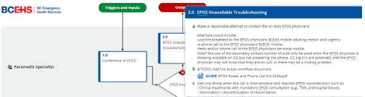
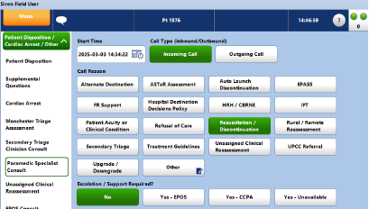

# Termination of Resuscitation (ToR)
**Decision Support Tool**

## Purpose

This Memorandum provides clarification on the expected workflow for BCEHS Paramedic Specialists when Emergency Physician Online Support (EPOS) is not available for emergent (time sensitive) consultation, and for new guidelines on when Paramedic Specialists can provide termination of resuscitation (ToR) decision support without EPOS consultation. 

Recognizing that the Paramedic Specialist team continues to experience times when EPOS is busy on a call or cannot be contacted through the standard procedure via ICE Anywhere, the following solutions and workflows will be implemented.

## Scope

ToR decision support requests from crews for **rapid discontinuation** or **unwitnessed cardiac arrest** will be supported by the Paramedic Specialist, with escalation to EPOS in specific cases where unusual circumstances warrant further clinical and/or legal discussion. For all other ToR decision making including patients that meet the 30-minute and 40-minute criteria, EPOS consultation is still required.

➤ **Rapid Discontinuation Criteria**

1. <u>Prolonged no-flow duration:</u>

    i. Patient observed to be unresponsive and presumed pulseless for at least 20 minutes prior to the arrival of emergency services; **and**

    ii. No CPR was provided during this period; **and**

    iii. The patient is not exhibiting any signs of life (see signs of life extinct); **and**

    iv. The patient’s cardiac rhythm is asystole, or pulseless electrical activity of less than 30 beats per minute, or an AED does not detect a shockable rhythm. 

**Note: if PEA escalate to EPOS if available**

2. <u>Terminal illness:</u>

    i. A patient in the final stages of a terminal illness where death is imminent and unavoidable and where CPR would not be successful, but for whom no formal “No CPR” decision has been made. 
    
**Note: Escalate to EPOS if no DNR available**

3. <u>Lawful direction:</u>

    i. When resuscitation is ongoing and a lawful direction to withhold CPR becomes available including an advance directive, a medical order for scope of treatment (MOST) a “No CPR” form or the discovery of a “No CPR” MediAlert bracelet or necklace. 

**Note: Escalate to EPOS if unclear**

4. <u>Valid direction from a representative:</u>

      i. A representative who is explicitly named in a Representation Agreement or an advance care plan may direct discontinuation of care.

      ii. A Power of Attorney does not have authority direct discontinuation of care. 

**Note: For legal decision making, escalate to EPOS**

➤ **Unwitnessed Cardiac Arrest Discontinuation**

A. Under R02 (modified): Discontinuation of Resuscitation, the Paramedic Specialist may advise ROLE on or after 20 minutes of CPR by emergency health care providers if the following 3 conditions are met. EPOS does not need to be consulted.

    1. **The arrest was unwitnessed by paramedics or EMRs/FRs**

    2. **No Shocks were delivered, and**

    3. **There was no return of spontaneous circulation regardless of duration**

**AND**, specific to PS ToR Decision Support:

    i. The patient is 17 years of age (pediatric excluded) 
    
    ii. Hypothermia is not a consideration

    iii. There is no evidence of drowning

    iv. The arrest was unwitnessed

    v. No organized rhythm on monitor when this can be determined

    vi. No agonal respirations

Special consideration and escalation to EPOS for any call that raises concern, including any indication of patient viability, or unusual circumstances such as pregnancy, CBRNE, unusual toxicological OD.

If these conditions are not met and/or there is an indication to continue resuscitation to the 30-minute mark, EPOS decision support is still required

* When advising a crew to stop CPR and perform ROLE there is no requirement to contact the EPOS physician after the event, however if there is any uncertainty, EPOS escalation should be initiated.

[Promapp – PS Termination of Resuscitation](https://ca.promapp.com/bcehs/Process/Minimode/Permalink/Gtltcuj7GGR7J3uxo7Piv6){:target="_blank .external-link}

## EPOS Unavailable Workflow

When a Paramedic Specialist is unable to contact EPOS on time sensitive calls, the Paramedic Specialist will make a reasonable attempt using the following options:

Make the following reasonable attempts to contact EPOS. If two EPOS physicians are on-duty attempt to contact both. Options for contacting EPOS when you have been unable to connect through ICE Anywhere include the following options:

  * Attempt to recontact on-duty EPOS physician through ICE Anywhere if showing available

  * Attempt line break when the EPOS physician is showing “in-call”

  * Text and/or Call the EPOS physician on their EPOS phone indicating the level of urgency. If calling, utilize the phone board to ensure a taped line

  * Text and/or Call the EPOS physician on their personal phone

If still no contact: **Track Event in CAD “EPOS unavailable”**

Provide the necessary advice to the crew using your clinical resources such as CPGs, your clinical experience, Paramedic Specialist partner, and the JAY tool.
Document the interaction thoroughly in SIREN including what attempts were made to contact EPOS and the advice provided.

Ensure “Yes - Unavailable” is selected in SIREN.

 * When advising a crew to stop CPR and perform ROLE there is no requirement to contact the EPOS physician after the event, however you can contact EPOS at any time to debrief any decisions that were made when EPOS was unavailable.

Through this escalation process, the Paramedic Specialist must make a reasonable attempt to contact EPOS via their BCEHS-issued EPOS phone and the physician’s personal device. Once these options are exhausted, and only in emergency (time sensitive) situations, a Paramedic Specialist may provide treatment guideline recommendations in place of an inaccessible EPOS physician. All recommendations must be justifiable within the BCEHS Ethics Framework.

**Quality Assurance**

As part of the QA process all calls that meet ToR and not requiring EPOS consultation will initially be reviewed. The following diagram demonstrates how the data draw will be initiated. Thorough ePCR completion with enough information to demonstrate that the patient meets the ToR workflow is critical. Any ePCRs that do not provide adequate information will have to have the Nice Tape pulled for audit, and a 1:1 review of documentation requirements will be provided by the Unit Chief or Practice Educators. Any Nice Tape reviews with inadequate information gathered will be reaudited by the EPOS Director or his designate.

## Frequently Asked Questions

**Q**: Should we advise the crew to contact their local ED and speak to the Emergency Physician for Discontinue Orders if we have exhausted all efforts to contact EPOS?

**A**: No, advise to discontinue and thoroughly document the occurrence. Local physicians are not necessarily familiar with our CPGs and may provide advice that is not aligned with our current practices. They also may be confused with the request and/or be unwilling to accept the liability.

**Q**: If I have advised a crew to stop CPR and perform ROLE after following the above algorithm, will I be supported by the organization?

**A**: Yes, the organization has provided you with guidelines to follow. Please document thoroughly, including advice provided and if the call does not meet PS ToR guidelines, also include any attempts made to contact EPOS.

**Q**: What if the request for EPOS is not time sensitive?

**A**: Request the crew to call back in x minutes or have them wait on the line until EPOS becomes available.

**Q**: Where can I find the EPOS work and personal mobile numbers?

**A**: All physician contact information in located in the ICE platform or can be found in the ProMapp workflow titled Engaging EPOS.

**Q**: Can I advise crews to work outside of their scope?

**A**: No, licensing does not support going outside of scope. In rare circumstances where a patient’s life or limb is in jeopardy, please consult with EPOS.

## Review Schedule

| Adopted | Next Review Scheduled | Owner | Reviewer| 
| :--- | :--- | :--- | :--- | 
| Apr 2025 | Mar 2027 | Clinical Hub Mnager | Clinical Hub |