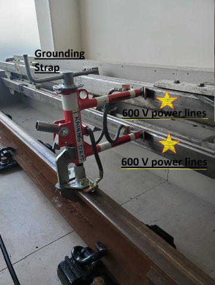
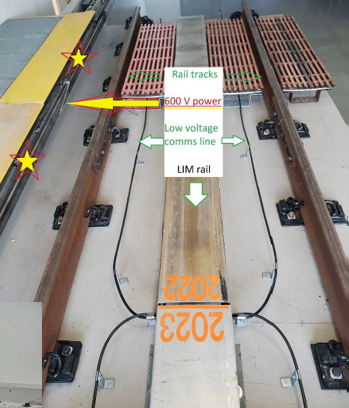

# Skytrain Response Safety

## Purpose

Provide high level view of rail tracks. 

## Definitions

1) **Rail tracks** are safe from electrical shock.

2) **LIM Rail** (no charge / safe) Linear induction motor

## Procedure

* A Sky Train Attendant becomes the “Area Coordinator”, ensures **Grounding straps are on AND power to the train is turned off.**

* Grounding straps NEED to be on (some stations 1 at each end of the train).

* Once safe, Fire Rescue will extricate pt., cars can be rolled by hand or lifted with Auto Ex tools.

## References

## Review Schedule

| Adopted | Next Review Scheduled | Owner | Reviewer| 
| :--- | :--- | :--- | :--- | 
| Dec 2024 | Mar 2025 | Clinical Hub Mnager | BCEHS OHS Team |