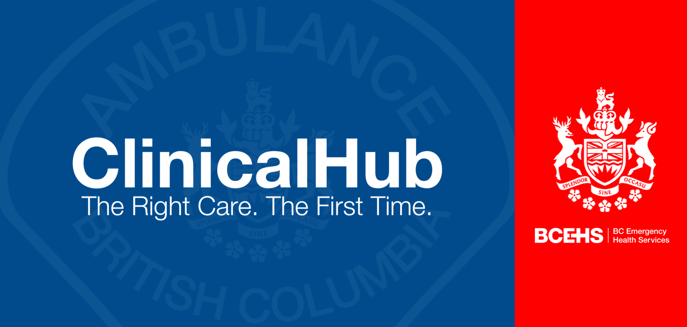

  
  Hub Wiki | Paramedic Specialist

---

## 🚑 Categories

| Section | Description | Link |
| :--- | :--- | :--- |
| **Clinical References** | Clinical guidelines and other clinical references | [Clinical References →](clinical/index.md) |
| **Operational Guidelines** | Practice Updates and operational resources | [Operational Guidelines →](operational/index.md) |
| **Safety Data Sheets** | Safety data sheets and other exposure resources | [Safety Data Sheets →](chemical/index.md) |

## 📅 Daily EPOS Schedule

  
<small id="sync-time" style="color: #666;">Loading today and tomorrow's schedule...</small>

  <table style="width:100%; border-collapse: collapse; text-align: left; margin-top: 10px;">
    <thead>
      <tr style="background-color: #eee; border-bottom: 2px solid #ccc;">
        <th style="padding: 10px;">Date</th>
        <th style="padding: 10px;">Shift Name</th>
        <th style="padding: 10px;">Provider</th>
      </tr>
    </thead>
    <tbody id="table-rows">
      </tbody>
  </table>

## ⚠️ Critical Alerts
!!! danger "Fraser IFT IV Pump Trial"
    **July 2, 2026**: Starting this month (July 2026), BCEHS will begin piloting interfacility patient transports by PCPs using volumetric medication pumps to safely administer medications during transport. This will allow PCPs to transport patients who previously may have needed a nurse escort. [More Info on the Intranet](https://intranet.bcehs.ca/mlink/post/NDA3Ng){:target="_blank"}

## ⚕️ Clinical Updates
!!! warning "Latest Practice and CPG Updates"
    * **March 27, 2026 | Epi Infusion:** Updated epinephrine medication infusions to include 15 drop set change. [Visit the Handbook →](https://handbook.bcehs.ca){:target="_blank"}
    * **March 25, 2026 | Parenteral Ondansetron:** Now considered first-line parenteral antiemetic for most causes of nausea/vomiting. ODTs remain available. [More Info on Intranet →](https://intranet.bcehs.ca){:target="_blank"}
    * **March 20, 2026 | Updated M09:** Revised Neonatal Resuscitation flowchart now live. [Visit the Handbook →](https://handbook.bcehs.ca/clinical-practice-guidelines/m-pediatric-and-neonatal-emergencies/m09-neonatal-resuscitation/){:target="_blank"}

    
