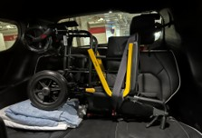
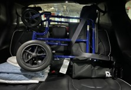

# LARU Transport Chair Trial   Guidelines and Cleaning

## Purpose

This trial is designed to address LARU utilization challenges and drive growth in appropriate patients. This approach leverages paramedic experience, innovative transport options, and paramedic led insights to create a tailored plan that delivers measurable results. With the addition of a transport chair to the LARU paramedic toolbox, more patients will get the care they need, sooner and more appropriately than with a regional resource or the use of wheelchair taxis.

## Definitions

a.	Transport Chair: Mobb or Drive Medical models of transport chair authorized to be on LARU unit.

b.	JAY Tool: “Justifiable, Accountable, You” tool available on the [Handbook](https://handbook.bcehs.ca/clinical-resources/miscellaneous-resources/jay-decision-making-tool/){:target="_blank .external-link} or Intranet.

c.	Reasonably level ground: any slope that could cause the device to roll or become unstable, typically an 8% grade (typical wheelchair ramp).

## Procedure

Transport wheelchairs are to be used by LARU paramedics only while working a designated LARU shift enrolled in the transport wheelchair trial. The decision on what patients are appropriate for the transport wheelchair relies on the paramedic operating the device, the use of the BCEHS JAY tool and the limitations of the device.

Once the attending paramedic identifies a patient to be moved via transport chair the following procedure is to be followed:

1)	Patient is clinically stable, physically able to stand and pivot, and paramedic has reviewed attached PMAT (Patient Movement Assessment Tool linked below)

2)	Patient weight is less than 300 lbs and physically fits between arm rests of the chair

3)	Patient consents to be moved via transport chair

4)	Ensure wheelchair had parking brakes set prior to any patient loading or unloading

5)	Paramedic assures route using transport chair is appropriate to traverse. Eg. No gravel, rocks, or obstructions AND operates on reasonably level ground 

6)	Paramedic safely transitions patient to chair and secures patient into chair

7)	Once patient is transported safely to LARU unit, transport chair is cleaned as per instructions and re-secured in vehicle prior to transport

8)	Post-call, QR code on transport chair is scanned and feedback sent to Clinical Hub

9)	Any damage/issues noted to chair results in an immediate Tag Out of the device with Clinical Hub contacted at laruoperations@bcehs.ca as soon as operationally possible

## Equipment Checklist

❑ Are all components present?

❑ Is the chair free of excessive wear?

❑ Do all screws, nuts, bolts, rivets, and roll pins appear to be securely in place?

❑ Do all moving parts operate smoothly and properly?

❑ Do all locks and brakes on the chair operate properly?

❑ Does the chair roll smoothly?

❑ Are the restraints properly installed?

❑ Is seat and back rest in good condition with no cuts or frayed edges?

❑ Are restraint buckles free of visible damage and do they operate properly?

❑ Is the Inspection decal compliant?

**Storage and Securement**

The transport chair will be located on the rear seat and secured with a seatbelt as illustrated below. If rear seating is needed to facilitate additional passenger spaces, the transport chair may temporarily be stored in the rear compartment attached with the retention cables.

| Chair Storage | Both Models |
| :--- | :--- |
|  |  |

## Cleaning Process
**Mobb or Drive Transport Chair**

**Required Supplies:**

❑ Accel PREVention Wipes (AHP-based disinfectant)

❑ Disposable gloves

❑ Face shield or goggles (if gross contamination is present)

❑ Soap and water (if gross contamination is present)

❑ Hand hygiene products (soap/water or alcohol-based hand rub)

❑ Brawny paper towels or equivalent

**Frequency of Cleaning:**

1. After each use

2. As part of pre-shift inspection as needed

**Step 1 - Preperation:**

❑ Perform hand hygiene before putting on PPE

  **Don appropriate PPE:**

❑ Disposable Gloves

❑ Face shield or googles (if required)

**Step 2: Inspection/Cleaning:**

❑ Inspect for visible soiling or damage (tears, fraying material, rust, broken connections, wheels)

❑ Clean lightly soiled surfaces with warm soapy water and brawny towel

❑ All surfaces must be dry prior to disinfection

❑	Disinfect the following areas with Accel prevention wipes:

❑ Seat base and seatbelts

❑ Backrest

❑ Footrest

❑ Handles and Brake Levers

❑ Wheels

❑ Focus on joints, crevices, and undersides removing components for thorough cleaning

❑ Chair Frame and Fixed Surfaces 

❑ Detach the footrest

❑ Set aside for separate cleaning

❑ Unfasten patient restraint straps and lay them flat for easier access

❑ Ensure full surface contact time (3 minutes)

❑ Surfaces must stay visibly wet for at least 3 minutes (or per label instructions)

❑ Allow surfaces to air dry before folding chair up

**Step 3: Grossly Contaminated:**

❑ Remove all restraints

❑ Thoroughly clean all components

❑ Contact LaRUOperations@bcehs.ca for replacement of grossly contaminated belts

**Step 4: Disposal and Hand Hygiene:**

❑ Discard used wipes/gloves in designated waste

❑ Remove PPE per doffing procedure

❑ Perform hand hygiene after each step of PPE removal

## References

**Related BCEHS Tools**

[JAY Tool](https://handbook.bcehs.ca/clinical-resources/miscellaneous-resources/jay-decision-making-tool/){:target="_blank .external-link}

[PMAT (Patient Movement Assessment Tool)](https://handbook.bcehs.ca/clinical-resources/clinical-references-cards/pmat-patient-movement-assessment-tool/){:target="_blank .external-link}

## Review Schedule

| Adopted | Next Review Scheduled | Owner | Reviewer| 
| :--- | :--- | :--- | :--- | 
| JUL 2026 | JUN 2027 | Clinical Hub Manager | Clinical Hub Manager |